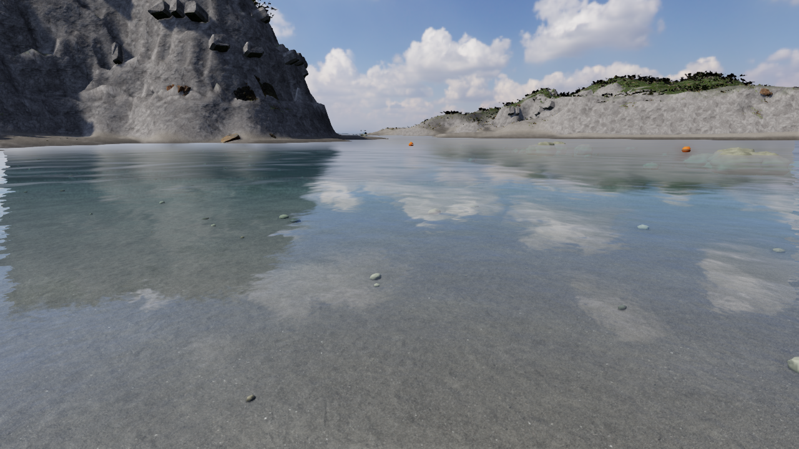

# SEA — 式根島、泊海水浴場。

泊の浜を歩き、透明な海を泳ぎ、岩場へ潜り、船で新島・神津島へ出かけるブラウザ上の3D体験です。Google マップの航空写真・地上写真と式根島観光協会の写真を参照し、国土地理院の陸上標高から島の地形を作っています。



写真と見分けがつかない品質という目標は、まだ達成していません。岩・砂の写真計測素材と照明は改善しましたが、崖の大形状、植生、海中の景観密度に差が残ります。海底と小さな岩の位置は現地測量に基づく再現ではありません。

最新の [V36 検証記録](./docs/verification-v36.md) では、左右の視点操作を修正し、感度・反転・キー割り当て・Mでの地図開閉を追加しました。336テストと内蔵ブラウザでの操作、保存版の設定復元を確認しています。全体の実写品質は引き続き未達です。

[V35 検証記録](./docs/verification-v35.md) では、船体の位置やUVを保ったまま三角面ごとの陰影を修正しました。3方向の比較と独立画像レビューを記録しています。

[V34 検証記録](./docs/verification-v34.md) では、水中で薄い破片に見えていた岩棚を砂へ接地させ、5種類の岩スキャンのUV・法線の境界を守る形状へ更新しました。327テスト、4視点の比較と独立した画像レビュー、浜から回収・納品・装備強化・潜水・乗船・羽伏浦への実航海・上陸までを確認しています。

[V33 検証記録](./docs/verification-v33.md) では、屈折候補の移動中のキャッシュ再構築を修正し、人体の全形状を保持するGPU変形を追加しました。324テスト、23姿勢の実GPU比較、70項目の失敗・復元検証と独立レビューを確認。geometry refractionは通常OFFのままで、海の実写品質の達成とは区別しています。

[V32 検証記録](./docs/verification-v32.md) では、泊の西側岩壁に5種類のスキャンを使った連続した立体の凹凸を加えました。複数視点と実際の壁際の歩行、形状・衝突、315テスト、独立レビューを確認しています。

[V31 検証記録](./docs/verification-v31.md) では、新島へ近づくと通常の世界のまま沿岸波が動くようにしました。波の数値減衰と水量損失を修正し、315テストと実GPU・入水動作を確認しています。

[V30 検証記録](./docs/verification-v30.md)では、泊から中の浦へ回収に出かけ、帰還・納品まで実画面で確認しました。別の浜でも現地の発見と持ち帰り先を案内し、310テストと6地点のCPU往復検証を通しています。

[V29 検証記録](./docs/verification-v29.md) では、遠い海面の黒い斑点を抑え、浅瀬・水中の比較と307テストを確認しました。

2026-10-07 の路面と反射の修正は [V26–V27 検証記録](./docs/verification-v27.md)、遠景植生は [V25 検証記録](./docs/verification-v25.md)、探索ゲームの追加は [V24 検証記録](./docs/verification-v24.md)、遊び方は [海の調査](./docs/gameplay.md)、全体ゴールと再開手順は [CLOUD_HANDOFF](./docs/CLOUD_HANDOFF.md)。元の実写品質・全海岸・連続した一人称体験のゴールを維持し、未採用の候補と未達の検証を区別しています。

## 開発環境で開く

Node.js 22.13以降または24系とpnpmを使います。

```sh
pnpm install --frozen-lockfile
pnpm dev
```

WebGL 2と浮動小数点描画に対応するGPUが必要です。対応しない場合は画面に説明を表示します。

## 遊び方

- **海の調査 / J** — 浜のノートを見つけ、浅瀬や海底で記録を回収し、泊の拠点へ持ち帰ります。ポイントでタンク・フィン・バッグを強化し、島の訪問スタンプや操船の自己ベストを集めます。進行はこのブラウザへ自動保存します。
- **歩く / 泳ぐ / 潜る** — 浜からそのまま海へ進みます。水深に応じて歩行から泳ぎへ移り、海の中へ潜れます。
- **ドラッグ** — 見回します。**WASD / 矢印キー**で移動、**Shift**で走ります。
- **Space** — ジャンプ・浮上。**C**で潜降。潜水中は深さと空気を表示し、残量が少なくなると浮上します。
- **M / 地図** — 島の地図を開閉します。地図・ノート・操作設定を開いている間は移動・航海・空気消費を止めます。
- **O / 操作** — 感度、左右・上下の反転、各操作のキーを設定し、このブラウザに保存します。上記は標準のキーです。
- **E** — 発見物を調べる、拠点に届ける、船の舷側ではしごをつかみ乗船・下船する操作です。船では**W/S**で加減速、**A/D**で舵を取ります。
- **島めぐり** — 中の浦、新島・前浜、羽伏浦・堀切・シークレット、神津島・前浜へ船で連続移動します。自動航海と手動操船で同じ船の速度と慣性を使います。
- **ものを置く** — 椅子、パラソル、浮き、タンク、岩、松を配置します。同じ場所への追加は重ならない位置を探し、岩は3種類の写真計測モデルを使います。「ひとつ戻す」で取り消せます。
- **海の表情** — 昼、夕凪、荒天、薄明、風、うねり、描画品質を変更します。
- **P / ひと休み** — 波と空気の消費を止めます。停止中も見回しと移動ができます。
- **H / 没入モード** — 操作画面を隠します。**Escape**で戻ります。
- **波の音 / カメラ** — 波音を再生し、操作画面を含まないPNGを保存します。

タッチ操作用の移動・上下ボタンもあります。OSで動きを減らす設定が有効なら、波を停止して開きます。

同じ景色を開くためのURLは `?view=shore`（水際）、`?view=cliff`（岩肌）、`?view=lookout`（高い場所）、`?view=dive` と `?view=reef`（水中）です。鑑賞用の開始位置であり、現地の遊歩道やダイビング案内ではありません。

## ビルドと保存版

```sh
pnpm test
pnpm build
pnpm preview
```

ビルドは型検査、Viteの本番出力、全素材を埋め込んだ `dist/sea.html` の生成を行います。単体HTMLは約260MBです。岩・岩棚・植生のGLB、HDR空、砂・葉・岩の画像、フォントとライセンスを含み、実行時に外部素材を取得する設計にはなっていません。

単体HTML本体は、V35で静的HTTPからの起動・素材の読込・描画・基本入力を確認しました。直接の`file://`起動は、この環境のブラウザURL制限により未検証です。`dist/` は通常の静的サイトとしても配信できます。今回の作業では新しい公開サイトのデプロイは行っていません。

## 地理と素材の根拠

泊の基準点は北緯34.3359808・東経139.2117451。Xは東、Zは南、Yは平均海面からの高さです。式根島・新島・神津島はGSIのDEM10B、泊はDEM5Aから作り、取得URLとハッシュを保持しています。泊の約1m、浜の約0.5mへの細分は作者による補間・形状調整であり、測量精度の向上ではありません。描画面と歩行判定、水深は同じ地形を使います。国土地理院の標高タイルを加工して作成しました。

- [Google マップの泊海水浴場](https://www.google.com/maps/search/?api=1&query=34.3359808,139.2117451) — 航空写真、地上・高所からの写真を参照。元画像はリポジトリへ同梱していません。
- [式根島観光協会・泊海水浴場](https://shikinejima.tokyo/play/beach/tomari_beach/) と [ダイビング](https://shikinejima.tokyo/play/diving/) — 景観と海中の参考。観光冊子の海中写真は島全体の参考で、泊の海底測量ではありません。
- [GSI標高タイル](https://maps.gsi.go.jp/development/demtile.html) — 陸上標高。取得日は測量日ではありません。
- [Poly Haven](https://polyhaven.com/license) — 3種の立体巨岩、2種の岩棚、実寸2.14mの砂PBR、昼のHDR空のCC0原本。現地の岩や空を撮影した素材ではありません。

砂浜の整形、海底、岩棚の追加位置、松・下草、魚・海藻・付着物、家具と船は作者による推定・演出です。葉と地形の一部素材には生成画像を使っています。近い岩は全方向の3Dスキャンなので、視点を変えても写真を正面に向ける看板にはなりません。

## 描画と検証

波は2スケールのGPU逆FFTで計算します。深さ・波の遮蔽、屈折と吸収、地形を含む水面反射、同じ水面法線で計算する屈折光、海中の光の散乱、PBR材質、影、露出と輪郭処理を組み合わせています。昼は実写HDRの雲、他の天候は体積雲の近似を使います。

現在の動作・数値・見た目の限界は [最新検証記録](./docs/verification-v27.md)、参照した写真・動画は [羽伏浦の全岸照合](./docs/habushi-reference-v10.md) と [前の参照記録](./docs/habushi-reference-v6.md)、素材の利用条件は [第三者ライセンス](./THIRD_PARTY_NOTICES.md) に記録しています。通常表示では反射の範囲不足と植生の寸法・詳細度を改善しました。浅瀬の有限体積計算 `?surf=1`、立体白水 `?whitewater=volume`、岩の組立 `?coast=photo` は開発比較用の候補です。実画像レビューで既定への採用を見送り、実写同等の達成とは扱っていません。旧版の記録も保持しています。
