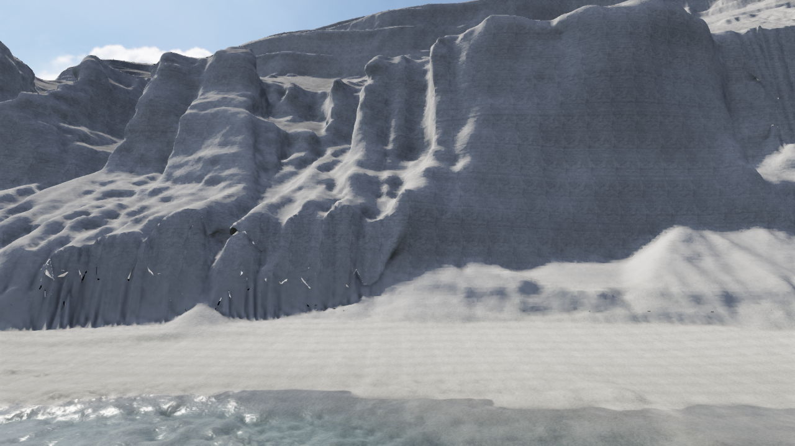
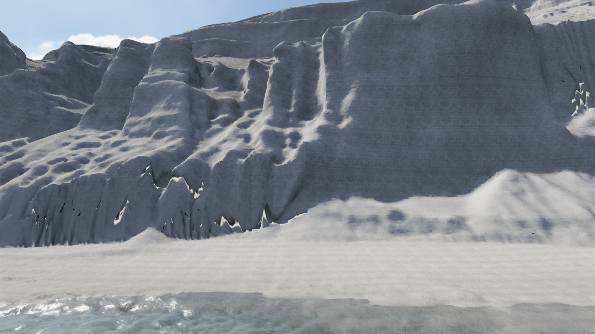

# V55 — 連続した3D面として崖をつなぐ

**V54より良い次工程用の試作。通常採用と実写品質は未達。** 海は基準に保ち、崖の接続を優先した。

## 変えた構造

V54では急斜面の三角形だけを置換し、約5万本の境界を縦壁で接続した。V55は斜面の角度による切分けをやめ、再構成面で覆える広い範囲をまとめた。元のnative格子は変更せず、元Meshの3D層とXZを保ち、境界から4mのYだけをquintic曲線で周囲の床へ合わせる。垂直の接続壁は使わない。

狭い初期試作では境界が51,676→1,487辺へ減った。さらに元LASから範囲をx5785–5950/y0–165/z−1090–−940へ広げ、550,987点を再抽出した。実点の高さは0.16–106.64mで、旧85m面による崖上の切断を除けた。[元データの記録](../checks/v55/source-receipt.json)。

拡張版の境界は2,105辺。描画は606,336三角形で、元格子の414,399三角形を置換。境界の最大Y移動11.057mは推定の加工である。native Y3–140、Z−1088–−942のguardがあり、raw投影面の全域や全海岸を置換したわけではない。[組立](../checks/v55/expanded-assembly.json)。

## 床を見える面へ合わせる

V54は元Poisson面を床へ使ったが、V55は**変形後のFloat32描画Mesh**を床照会にも使う。描画・静的衝突も同じMesh。strict照会で境界が欠けた場合だけ、10µm以内の実三角形上の最近点へ合わせる。高さは凸補間し、負のbarycentricによる外挿をしない。native採用mask外へこの救済を適用しない。

被覆面積許容と最近点距離は別の予算。2e-6m²以下の残存面積は実在する小穴も許す近似で、全点finiteや閉鎖の証明にはならない。残存polygonを取り出す検証用APIも追加し、予算超過時の空配列を被覆成功に使わない。

原点をnative共通位置へ移す試作は、Float32の局所XZ精度を悪化させ、198三角形で面積予算を超えた。残存polygonの頂点・辺中点35,512照会では最大約32µmの距離があった。許容値を緩めて通さず、近い原点`[5880,0,-1015]`を保持した。[不採用の数値検証](../checks/v55/rejected-shared-origin-residuals.json)。

## 見た目と失敗した方法

正面・海岸沿い・近景・沖合・旧両端・新しい外周の8視点を実WebGLで描いた。崖上の斜め継ぎ目と縦カーテンは減り、沖合の岩棚も増えた。一方、足元の白黒の裂け、外周の形態差、均一な材質と規則的な段が残る。[独立レビュー](../checks/v55/independent-visual-review.md)は拡張版を次工程用として選び、通常採用を却下した。



境界で下層を地面内へ収める試作も行ったが、大きな鋸歯状の裂けが増えた。実画面の結果から戻し、失敗したAPIも通常のhelperから退避した。数値テストの合格を見た目の合格にしない。



次は単一のhighest-Y床や頂点Y調整だけで接続を終えず、側壁・上面・内側の面の対応を修復する。形を通した箇所から、岩・軽石の堆積・乾燥砂・濡れ砂の材質を分ける。元点の未観測面、写真の原出典確認、通常の連続入力と全旅程の確認も未完了である。

## 再実行

```text
python scripts/reconstruct-niijima-poisson-expanded.py --source /path/to/09QC1711.zip --output /path/to/new-study
node --experimental-strip-types scripts/assemble-niijima-point-cliff.mts --study expanded --output work/new-v55-study
```

組立は固定source assetを使い、描画SHA256とfootprint SHA256の一致を実行確認した。[再実行記録](../checks/v55/assembly-replay.json)。開発サーバーの`poissoncoast=2`は狭い版、`poissoncoast=3`は拡張版。通常配布へ候補assetを埋め込まず、全体ゴールはACTIVE/UNMETを維持する。
