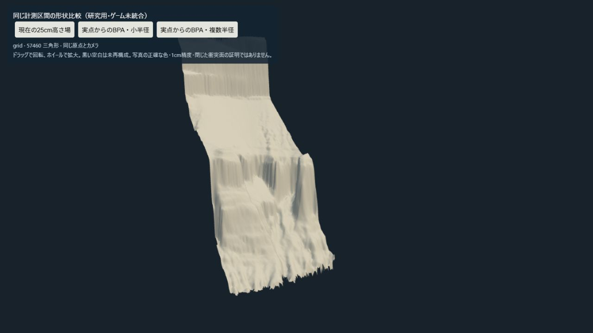
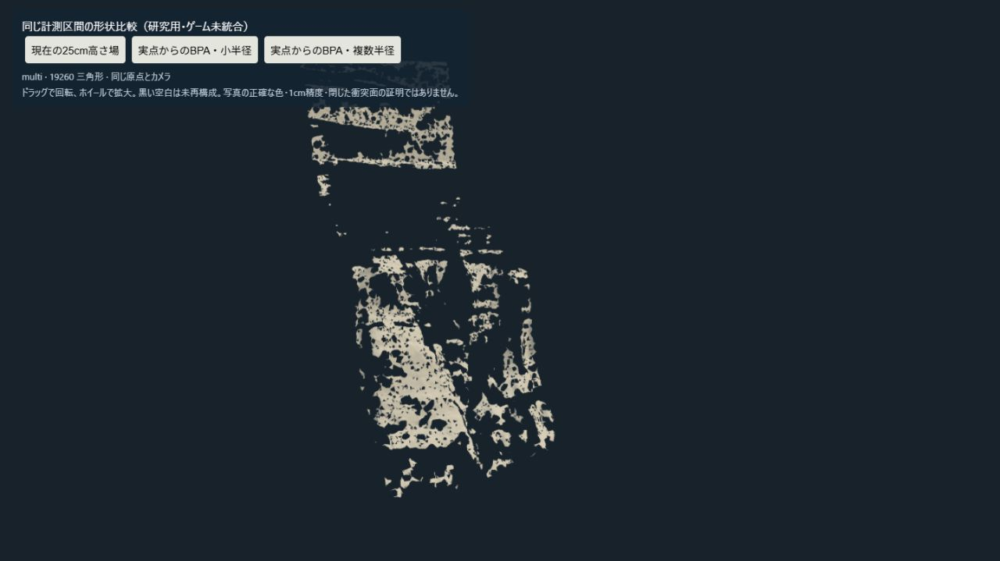

# V53 — 外部実装を取得し、実際の崖データで試す

2026-10-09。海の描画は現状を基準とし、崖と植生へ優先順位を移した。[全要望の先行研究](sea-prior-art-v51.md)に加えて、今回は公開ソースを取得して関数を読解し、一つの方法を実測データで実行した。取得したリポジトリ数は画質の達成指標ではない。

## 取得・読解した実装

- **Open3D** — `b6c5e196384ad71e75b6e6f9c5da22d046221f1d`。MIT。法線推定と [Ball Pivoting](https://github.com/isl-org/Open3D/blob/b6c5e196384ad71e75b6e6f9c5da22d046221f1d/cpp/open3d/geometry/SurfaceReconstructionBallPivoting.cpp#L148)を確認した。入力点を頂点として使い、球の半径と法線の関係で面を作る。[Poisson](https://www.open3d.org/docs/release/tutorial/geometry/surface_reconstruction.html#poisson-surface-reconstruction)は未観測域への外挿も行うため、今回の「測られた側面がどこまであるか」という確認には採用しなかった。ローカル実行は配布版 **0.19.0** で、取得したmainをコンパイルした実行ではない。
- **Infinigen** — `3f58bb886bb1bda681d41240344fe3126ac0e9bd`。読解したコードはBSD-3-Clause。[sandstone](https://github.com/princeton-vl/infinigen/blob/3f58bb886bb1bda681d41240344fe3126ac0e9bd/src/infinigen/assets/materials/terrain/sandstone.py#L404)の複数スケールの幾何変位、[boulder](https://github.com/princeton-vl/infinigen/blob/3f58bb886bb1bda681d41240344fe3126ac0e9bd/src/infinigen/assets/objects/rocks/boulder.py#L63)の外形生成、[tree](https://github.com/princeton-vl/infinigen/blob/3f58bb886bb1bda681d41240344fe3126ac0e9bd/src/infinigen/assets/objects/trees/tree.py#L206)の成長方向と分岐、[配置](https://github.com/princeton-vl/infinigen/blob/3f58bb886bb1bda681d41240344fe3126ac0e9bd/src/infinigen/core/placement/instance_scatter.py#L153)の密度・選択マスクを確認した。Blender用の生成結果をブラウザ向けに変換する工程が必要で、新島の地形や植物同定を自動的に保証するものではない。今回は生成実行していない。
- **Unity Labs procedural-stochastic-texturing** — `a77263f336611c3b7acf021d5942207ee7223602`。[前処理](https://github.com/UnityLabs/procedural-stochastic-texturing/blob/a77263f336611c3b7acf021d5942207ee7223602/Editor/ProceduralTexture2D/ProceduralTexture2DEditor.cs)と[描画時の処理](https://github.com/UnityLabs/procedural-stochastic-texturing/blob/a77263f336611c3b7acf021d5942207ee7223602/Editor/ProceduralTexture2D/SampleProceduralTexture2DNode.cs)を確認した。色空間の非相関化、Gaussian変換、分散を補正する混合、LOD別の逆変換が必要で、単純なランダムUV混合とは異なる。数値対角化部分にはLGPL 2.1-or-laterの表示があり、全体を一括でMIT等とは扱わない。取得ソースは参考用に保持し、SEAへコードを転載していない。

3つの取得先は別の開発元。各リポジトリ内の複数ファイルを独立した裏付けの件数には数えない。4件のSol/low担当の実行記録と親の起動記録を照合し、公開情報の担当にはローカル・私有情報を渡していない。親は取得したソース、ライセンス、実行結果を確認した。

## 実際の崖での試行

承認済みの東京都 `09QC1711` 元LASから、まず約124万点の周辺ROIをXYZ・色・分類のまま保持した。従来の25cm高さ場への平均化で消える情報を確認するためであり、124万点すべてが崖の側面を測った点という意味ではない。

さらに30m幅の小区間を抽出し、class 2の60,985点から急な面に属する13,456点を選んだ。Open3D 0.19.0のBall Pivotingを、点間隔中央値約0.142mから決めた2通りの半径で実行した。

- 小半径：11,853頂点、16,158三角形。
- 複数半径：12,660頂点、19,260三角形。大きな辺と支持が弱い面を除外した後の数。
- どちらも閉じた立体ではない。ブラウザ上の同じ原点・照明・カメラで確認すると、多くの穴が残った。通常の地形・歩行・衝突への置換は行っていない。





比較画面は研究用の幾何表示。色は共通の単色で、現地の写真色や現実の照明を再現した画面ではない。

## 「穴を埋めた」を「測れた」と扱わない確認

観測密度の高い0.5mのセルを一つ選び、半径0.35mの円内にある20点を意図的に取り除いて再構成した。小半径ではその円を横断する面の検出が0、複数半径では5枚だった。どちらの頂点も学習側の元点との距離は0だった。

つまり、元の点だけから作る手法でも、面が未観測部分を架橋することはある。留保した点への距離が小さくなることだけを、現地の測量精度や写真品質と呼ばない。詳しい条件は[留保試験](../checks/v53/holdout-receipt.json)と[再実行結果](../checks/v53/sidewall-receipt.json)に残した。

## 再実行

[再構成スクリプト](../../scripts/reconstruct-niijima-sidewall.py)は既に取得した元ZIPを入力とし、ダウンロードやゲームの地形変更を行わない。既存の出力を上書きしない。

```text
python scripts/reconstruct-niijima-sidewall.py --source /path/to/09QC1711.zip --output /path/to/new-study
```

依存：numpy、laspy、pyproj、scipy、open3d==0.19.0。入力のSHA-256を既知の元LASアーカイブと照合する。出力PLYとreceiptは研究用であり、ゲームへ自動採用されない。

## これをどう改善につなげるか

最優先は、測れている局所面と実景の位置を対応させ、写真から分かる層の厚み、張り出し、侵食、崩落斜面を分けた3Dへすること。未観測部分の補間は推定として明示する。Infinigenからは帯の描画ではなく幾何変形と個体生成の構成を参考にする。

細粒の写真素材には、独立実装したヒストグラムを保つ混合を一枚の素材で試し、近景と遠景の色・コントラストを確認してから広げる。植物は既存の個体を伸縮するだけでなく、枝の成長方向と同じ風向に対応した複数の外形を作る。現地の種・群落・空白との照合は別に必要。

海の再調整より、崖・植生、続いて船体・身体と道具の接点・探索の遊びを優先する。全体の実写品質、全旅程、完成後の紹介動画は未達のまま維持する。
