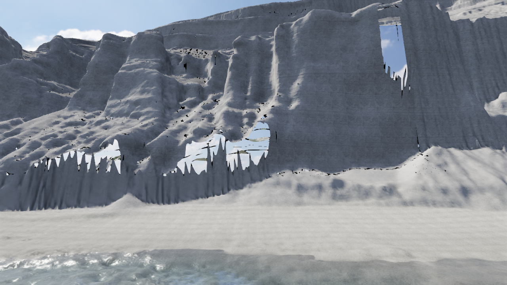
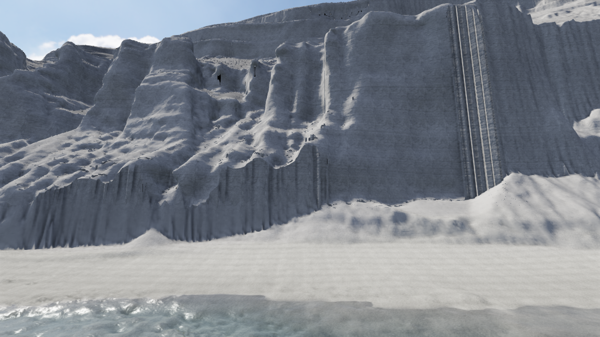

# V54 — 外部再構成手法を崖・床・水際・衝突へつなぐ

**実写品質は未達。今回の崖は通常採用を却下し、開発用の試作として保存する。** 海の調整より崖・植生を優先する方針を維持する。[全要望の先行研究](sea-prior-art-v51.md)と[取得した外部ソース](sea-external-methods-v53.md)から、Open3DのPoisson再構成を実際に実行・組み込みした。

## 実際に使った手法

[Open3Dの公式手順](https://www.open3d.org/docs/release/tutorial/geometry/surface_reconstruction.html#poisson-surface-reconstruction)と[実装](https://github.com/isl-org/Open3D/blob/v0.19.0/cpp/open3d/geometry/SurfaceReconstructionPoisson.cpp)を参照。配布版0.19.0の法線推定・MSTによる向きの整合・Poisson depth9を使用した。取得済みmainをコンパイルした実行ではない。Poissonの未観測側壁は推定であり、観測された面や測量精度とは区別する。

東京都の元LAS `09QC1711.zip` をSHA256で照合し、class2/non-withheldの220,015点から重複を除いた219,988点を使った。110mの局所区間、SEA座標x5810–5950/y3–85/z−1070–−960。密度の下位5%は診断ラベルに留め、除去していない。crop-onlyは291,349頂点/580,589三角形、1成分、境界2,105辺で、閉じた立体ではない。[元ZIPからの実行記録](../checks/v54/original-source-receipt.json)。

元ZIPから作る公開スクリプトと最初のNPZ試行は、頂点数・三角形数が一致。相互の最近傍頂点距離は中央値0、95%点で約1.9µm、最大約0.49mmだった。[比較](../checks/v54/original-proof-shape-comparison.json)。これは再計算と格納の数値比較であり、現地の1cm精度を示さない。

## ゲーム世界への接続

単に新しいMeshを重ねると、見える面と歩行床がずれる。元の25cm格子は変更せず、全面被覆と有限floorを確認した102,818三角形の置換を先に計画し、その範囲に再構成Meshをクリップした。計画・元Mesh・描画MeshのSHA256を照合してから変更する。読み込み失敗や破棄後の処理は元地形を保持する。

native三角形ごとにすべてを分割すると205万面に増えた。三角形の投影全体が被覆される箇所では元の3D面を保つ処理を追加し、799,066面へ削減した。明示した投影残差予算は1e-12m²。受入残差の実測合計は5.35e-13m²で、面積による実形状の除去はしていない。[クリッピング記録](../checks/v54/clip-receipt.json)。Float32格納と1e-7mでの頂点統合は別の近似である。

描画と静的衝突は同じクリップ済みMeshを使う。床は採用maskの内側だけ元の再構成面の最高面を参照し、水深マップも同じ床から再作成する。Float32でクリップした境界には微小な隙間があるため、厳密な閉鎖や任意の張り出し下を歩けることは保証しない。

横から見ると、新旧の高さの違いで大きな穴が見えた。51,676境界辺を抽出し、20cm以下の区間に分けた推定接続面206,685三角形を作った。155,028照会は全て有効。ただし最大の高さ差は30.896mあり、接続面が人工的な縦壁になる。穴を減らしても、見た目の合格には届かなかった。





## 見た目の判断

正面・海岸沿い・近距離・沖合・両端の6視点を実際のThree/WebGLで保存した。[カメラと状態](../checks/v54/cameras.json)。静止状態を明示して描いたもので、通常の連続入力・FPS・航海の証拠ではない。

[独立レビュー](../checks/v54/independent-visual-review.md)は通常採用を却下。局所的な縦溝の単調さは減ったが、カーテン状の接続、黒い欠け、丸くなりすぎた岩、岩・堆積斜面・砂の一様な材質が残る。まず面の接続と中規模形状を直す必要がある。

保管参照JPEGの同一性はSHA256で確認したが、原URL・撮影者は復元できなかった。「公式」のファイル名だけを原出典確認に使わず、画素を公開・材質転用しない。別途、[新島村の海岸説明](https://www.niijima.com/kankou/niijima/spot/2014-0214-1108-90.html)と[村の砂・堆積研究](https://niijima.com/facility/community/hakubutsukan/files/H14_kiyou016_ocr.pdf)を確認した。岩壁、崩落した軽石の堆積、波で磨かれ選別された浜を同じ材質で覆わない。これらの資料と保管JPEGの同一性は未確認である。

生成した細粒PBR素材と512段の推定地層loftも採用保留。粒模様や規則的な横棚だけでは、岩の形の不足は解消しなかった。

## 再実行

元ZIPは別途、承認済みの配布元から取得する。Python依存はnumpy/scipy/laspy/pyproj/open3d==0.19.0。

```text
python scripts/reconstruct-niijima-poisson.py --source /path/to/09QC1711.zip --output /path/to/new-study
node --experimental-strip-types scripts/assemble-niijima-point-cliff.mts --output work/new-v54-assembly
```

前者は元点からの研究再構成、後者はリポジトリ内の固定再構成assetをnative格子へ組み立て直す。既存の出力・ゲームassetを自動更新しない。両方を実行確認し、組立後のrender SHA256とfootprint SHA256の一致を確認した。

開発サーバーだけで `?capture=1&view=secret-north&poissoncoast=1` を指定すると試作を観察できる。`nativegeology=1` と `pumicegrain=1` も開発用。通常配布版には候補を起動する入口も候補assetの埋め込みも入れない。水中・船体・一人称の接点・全旅程・遊び・自然音・最終紹介動画のゴールは未完了のまま維持する。
