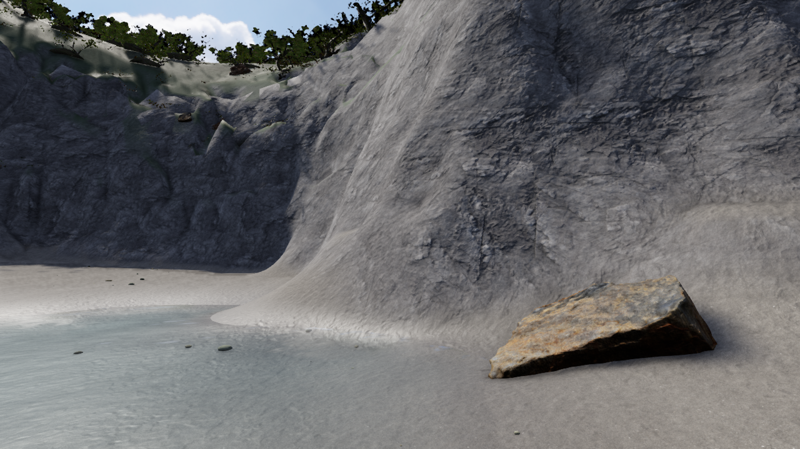
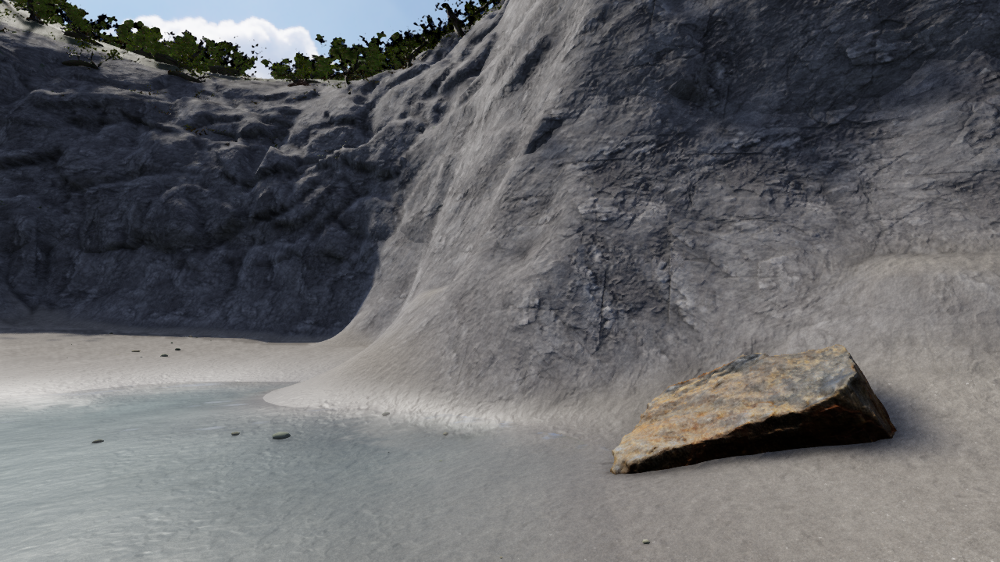
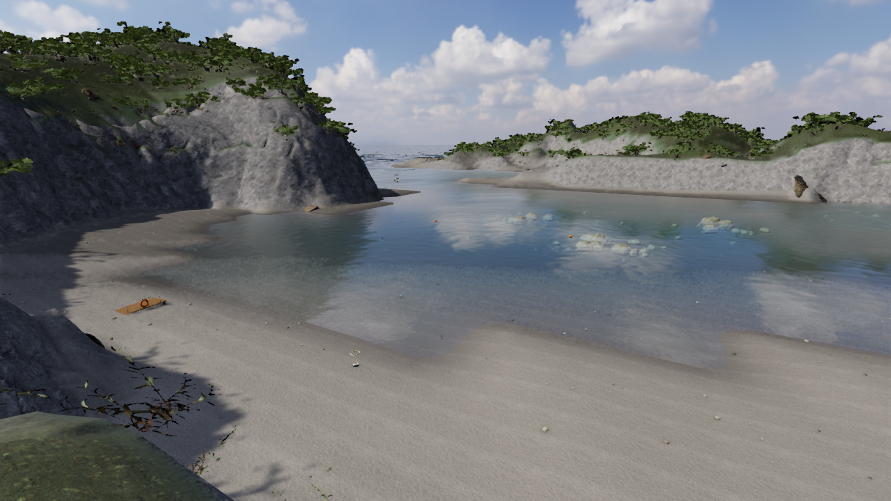
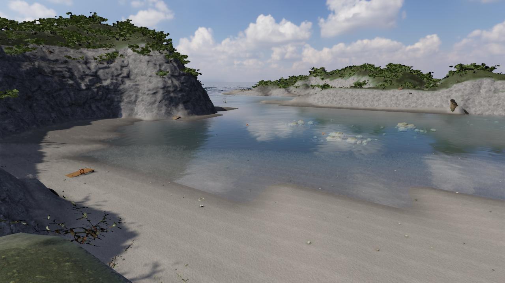
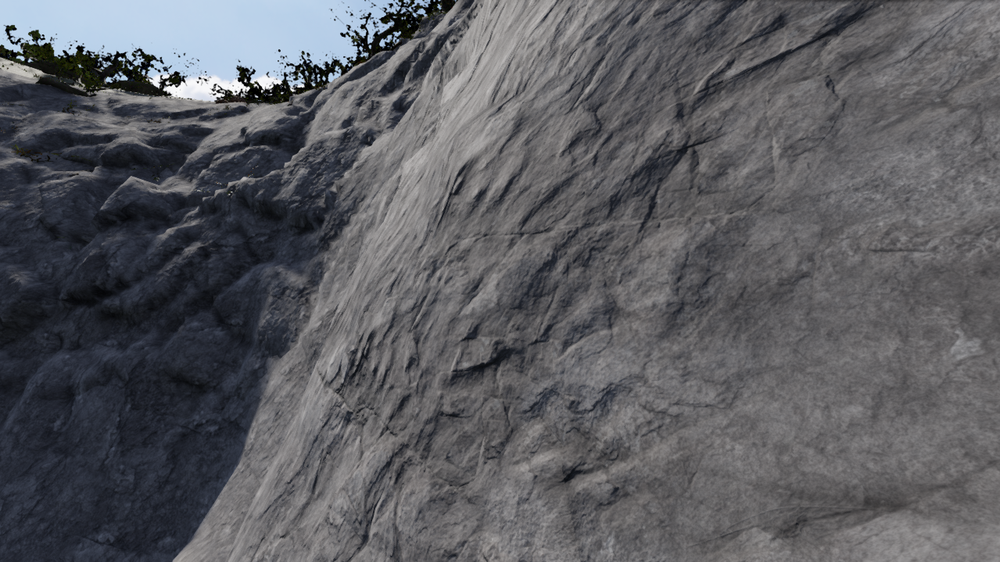

# V32 — 泊の西側岩壁に連続した立体の凹凸を追加

実装: `44587a71a4af49ee521b53c43d65a386c26e1718`。比較元: `18d3cbc62764dcc63993f7e656f876f8ec4f1e72`。

西側の壁は、近づくと細かい材質だけが見える滑らかな面でした。5種類のCC0岩スキャンから実際の形状の起伏を取り出し、既存地形の正面へ連続した閉立体として組み込みました。大小の割れ目、向き、張り出しを変え、別置きの岩が貼り付いた印象や、太い溝の反復を弱めています。通常表示で有効です。比較用の `cliffvolume=0` で追加形状だけを外せます。

現地写真は形の参照であり、写真の画素を素材へ転用していません。岩の配置・細部・裏面は推定です。泊を写真測量したモデルではありません。既存の標高、砂浜、水深、航路を変更せず、材質は周囲と同じ岩のPBRを使います。

| 比較元 | 改修後 |
| --- | --- |
|  |  |
|  |  |

## 確認した範囲

- 315テスト、TypeScript、Vite、単体HTML生成に成功。
- GLBは1 mesh、124,760三角形。読み戻し後も閉じた辺と有限座標を確認。裏面・端部の三角形を頂点、辺の中点、重心の計431,326点で調べ、最も浅い点も地形内へ約5.3cm埋まっています。これは離散サンプルの検査であり、連続面の厳密証明ではありません。
- 実描画と同じ三角形を衝突へ登録。CPUの壁5経路は停止し、浜・航路の3経路は通過。元のDEMと地形サンプリングは保持。
- 通常設定のブラウザーで、QAの開始位置から35秒間、接近・離脱・横移動・再接近を実コントローラー入力で実行。2,024フレームで歩行・接地を確認。最初の180フレームを除く中央値17.6ms、95%点19.8ms。全シーンのRAF間隔であり、GPU単体の計測ではありません。
- 砂浜・高所・岩壁・横・未調整視点・水中を表示。至近距離は実際に歩いて近づいて撮影。別のQAカメラが新しい立体の内側に入った画像は受入から除外しました。
- 昼と夕方で陰影を確認。独立した画像レビューは、平滑さの改善と反復溝の修正を限定採用。別のコードレビューでも、非同期読込、解放、共有材質、衝突登録に採用を止める問題は見つかりませんでした。



## 再生成と可搬性

`scripts/build-tomari-cliff.py`、`scripts/geometry/tomari-west-context.json` と同梱済みの元スキャンから再生成し、配布GLBとSHA-256が一致しました。Blender 5.1.2で確認しています。

```sh
blender --background --factory-startup --python-exit-code 1 --python scripts/build-tomari-cliff.py -- --output work/tomari-cliff
node --experimental-strip-types scripts/verify-tomari-volume.mjs work/tomari-cliff-check.json
```

GLB単体は灰色の確認用材質です。ゲーム内の世界座標PBRは `makeCliffMaterial` により適用します。GLBを書き出しただけでゲームと同じ質感になるとは扱っていません。

Blender側でも5方向の画像を生成し、画角内の収まりと形状を確認しました。画像アセンブリの自動レビューは、3視点で内部パラメーターの計測差が0.005pxの許容値を超え、`INCOMPLETE`です。最大差は0.00859px。実際のカメラ設定は一致しており、世界座標上の1mの投影プローブによる数値差と考えられますが、自動PASSには書き換えていません。[計測値](checks/v32/camera-precision.json)と実ゲームの画像・衝突検証を区別して保存しています。

## 未達の条件

全体の実写品質、全海岸の形・植生・海中景観、体・手・船、全島の実画面での旅の確認は未達です。今回の岩壁にも浅い棚の反復が少し残ります。大きい単体HTMLそのものの起動は未検証です。

最終紹介動画は全体完成後に、実際のゲームから広角・近景・潜水・船・島々を撮影して制作します。過去の泡や樹冠の短い検証動画を、最終紹介動画として扱いません。

機械可読記録: [runtime.json](checks/v32/runtime.json)、[形状・衝突](checks/v32/geometry.json)、[連続移動](checks/v32/movement.json)。
