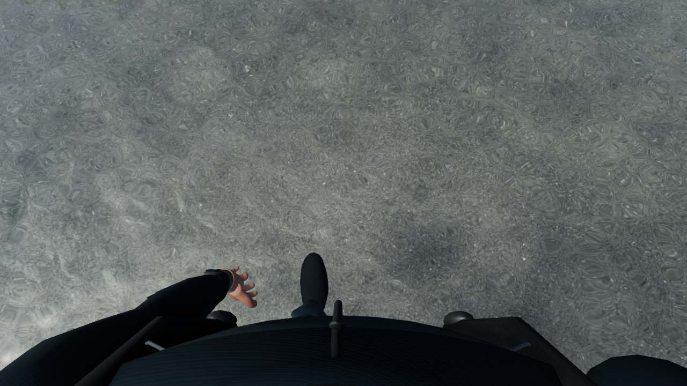
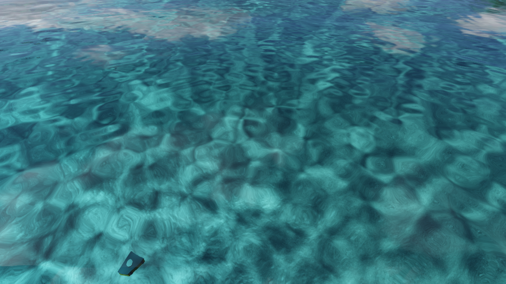
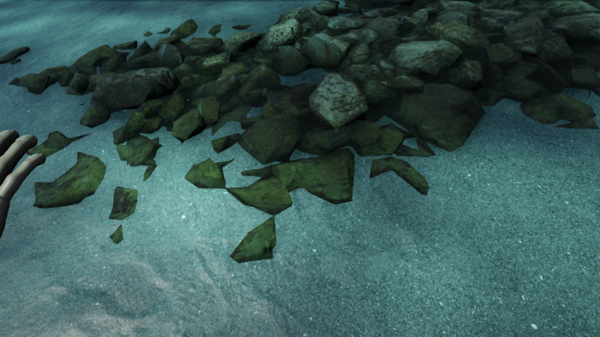

# V33 — 屈折候補の全身変形をGPUへ移し、移動時の停止を修正

実装: `3985d2cfdd3e66e464c20b96e97a44ad859e71b6`。比較元: V32 `4b6764a8d83b55eaa7868be25ac47263da74747d`。

浅瀬が灰色に見える原因を、海底・反射・透過・屈折経路の実GPU値と、[式根島観光協会の泊の写真](https://shikinejima.tokyo/play/beach/tomari_beach/)で確認しました。通常の水面は画面上の深度を使うため、浅い場所でも屈折経路が長くなる場合があります。一方で、海底の灰色と周囲の崖の反射も色に寄与しています。今回、水深や吸収係数を根拠なく変えて青色へ寄せる変更は行っていません。

実形状に光線を当てる既存の屈折候補では、歩行中に地形・素材のキャッシュを作り直し、最大約5.8秒停止する問題がありました。固定した形状の登録と、その時点の表示・高さ・個数の選別を分離しました。また、人体の全19,372頂点・36,700三角形を保ったまま、骨による変形と検索用の境界更新をGPUで行う候補を追加しました。

**通常のgeometry refractionは引き続きOFFです。** `gpuskin=1` は開発比較用です。GPU処理の正確さと動作を検証しましたが、水の見た目が実写同等になったことや、屈折候補を通常採用したことは意味しません。

## 確認した範囲

- 全324テスト、型検査、本番ビルド、単体HTML生成に成功。最後のshaderエラー監視の後処理修正後にも、型検査・ビルド・実GPUの一連の確認を実施しました。
- 7動作の3姿勢と、原点から±6kmの計23姿勢をCPUとGPUで比較。頂点・法線、材質・UV・色、全三角形の境界包含を確認。最大位置差は約0.000488m、最大法線成分差は約4.47×10⁻⁷でした。Float32の誤差と外向き境界余白を含む比較であり、無誤差とは扱っていません。
- 別canvas上の実GPUで70項目を確認。DPR 1/2/0.75、描画先とviewport/scissorの復元、前後の別データの保持、拡張と縮小、shader失敗、context loss、再生成が通りました。XRは状態フラグの復元のみで、実ヘッドセット試験ではありません。
- 固定1280×720で各12秒間、同じ開始姿勢から実コントローラー入力を使って歩行。geometry OFFは中央値17.7ms・95%点19.7ms、GPU候補ONは21.9ms・27.2ms・最大38msでした。地形とatlasの構築は各1回、通常フレームのGPU読戻しは0 bytes。全シーンのフレーム間隔であり、GPU単体時間ではありません。終点は約11cm異なります。
- QA開始位置から35秒分の泳ぎ・潜降・浮上入力を行い、最大約9.40mから浮上、空気の回復を確認。自動畫質で1049×590、画像保存の待機を含む観測は54.59秒、中央値19.9ms・95%点27.1ms。固定解像度の歩行試験と同条件ではありません。通常の浜の開始位置から全行程を通した証拠でもありません。
- 低DPRで診断画像の半分しか描かれない不具合を修正。4×1の検査用描画先へDPRを二重適用していました。修正後は4/4光線で命中と材質が一致、最大命中位置差約1.59×10⁻⁶m。旧4本目の不一致を人体形状の欠落と扱いません。4本だけの局所検査である点は保持します。
- 独立した担当がソース・diff・保存済み実GPU証拠をレビューし、今回の候補受入を妨げる問題なしと判断。レビュー担当自身による別GPU実行ではありません。

| 屈折候補を使う歩行 | 実入力で浮上した画面 |
| --- | --- |
|  |  |

## 実装と失敗時の挙動

頂点の変形、三角形データへの展開、深い階層からの境界更新を順に描画します。二つの描画先に現姿勢の三角形を揃えた後、境界の行だけを書き換えます。合成結果は既存の屈折textureへ接続し、水面のsampler数を増やしません。

非対応の行列・数値範囲、浮動小数点描画先の不成立、context loss、shaderのリンク失敗はCPUへ戻します。失敗したshaderで描画する前に確認し、古い結果を正しい新姿勢として採用しません。GPUの描画先とCPUのtextureの所有権を分離し、借用先の解放や拡張時の残留を防ぎます。

## 未達の条件

浅瀬の色、海底の配置と材質、水中で浮いて見える板状の岩・植生、全海岸の形、体・手・船、全島の実画面の旅は引き続き改善が必要です。海底は実測形状ではなく、今回の公式写真も数値の水深測量ではありません。水中の画像には明確なCGらしさが残っています。

大きい単体HTMLそのものの直接起動、全体の実写品質、完成後の最終紹介動画は未達です。全体のゴールを維持して次の実表示の改善へ進みます。

記録: [実GPUの姿勢・ライフサイクル](checks/v33/gpu-validation.json)、[移動と光線の要約](checks/v33/runtime.json)、[独立レビュー](checks/v33/review.json)。
