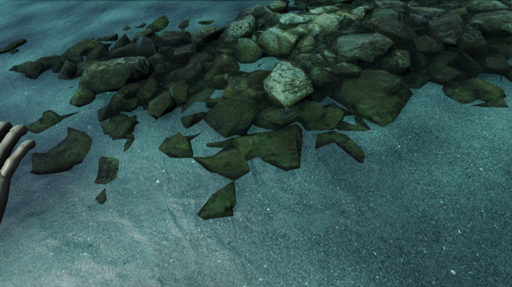
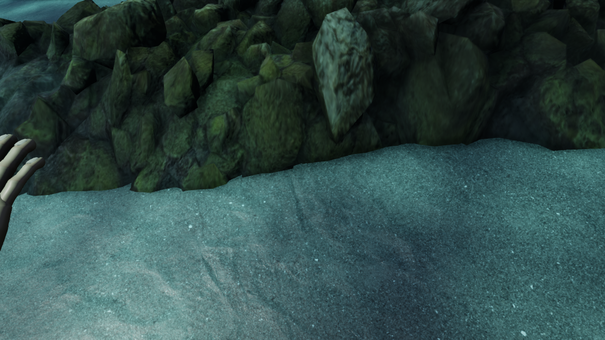
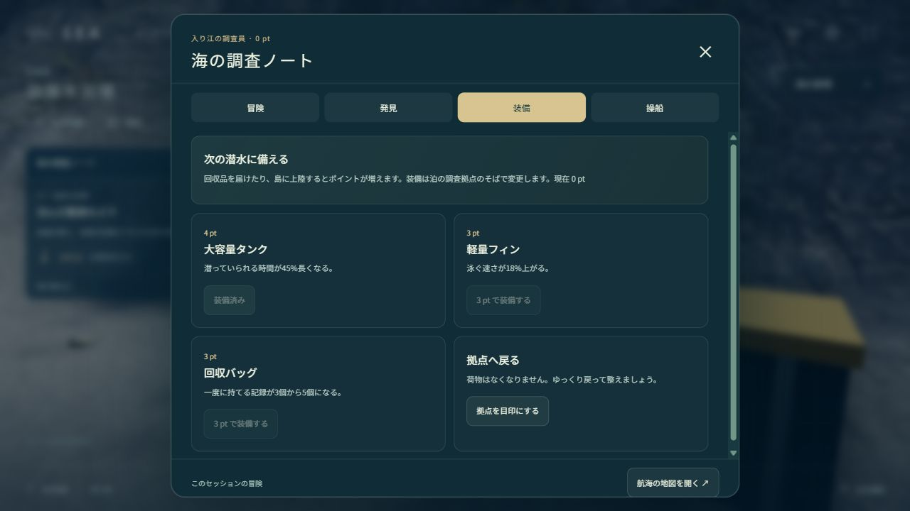
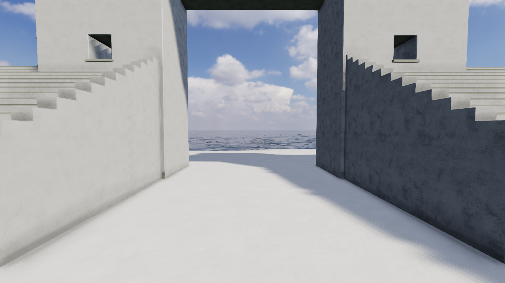

# V34 — 海底の岩の接地とスキャンの模様を修正

実装: `bb013a4b5c6b825ef82f34e4e9a0a378bb1c6642`。比較元: V33 `09538cba2588c41cc8660edb6f3f02e331a29898`。

潜水中に見える緑の薄い破片を画面上で選び、海藻ではなく岩棚のスキャンと特定しました。元の処理は岩の高さを半分に縮め、全体を30cm埋めていたため、頂部だけが切れ端のように露出していました。

元スキャンの外周から撮影地の地面の傾きを推定して差し引き、石の凹凸を現在の海底へ合わせました。外周は場所ごとに異なる幅で砂へ埋め、写真の長方形の範囲が厚い台座として見えないようにしています。新しい砂の入り込みは作者の推定で、泊の海底測量ではありません。海底の基礎標高は変更していません。

| 修正前 | 岩棚とUVの修正後 |
| --- | --- |
|  |  |

## 写真素材をつなぐ境界の修正

軽量化した5種の岩には、元のUVや法線で分かれた連結領域をまたぐ三角形が計1,493枚ありました。[meshoptimizerの公式説明](https://github.com/zeux/meshoptimizer/blob/master/js/README.md#simplifier)のとおり、旧処理の`Permissive`は属性境界を越えた縮約を許可します。これを使わず、ハッシュを固定した元データから形状を再生成しました。

元の連結領域をまたぐ三角形は5種とも0枚になり、近景にあった四角い模様や不連続な筋の一部が消えました。この件数は元の頂点indexの連結成分を使う検査であり、すべてのUV歪みや見た目の問題を測る値ではありません。元の写真・normal・ARM画像は変更していません。

| 素材 | 旧形状の境界越え | 修正後 | 修正後の三角形数 |
| --- | ---: | ---: | ---: |
| boulder_01 | 1,100 | 0 | 54,106 |
| namaqualand_boulder_02 | 86 | 0 | 17,995 |
| namaqualand_boulder_03 | 1 | 0 | 18,000 |
| coast_rocks_01 | 144 | 0 | 17,999 |
| coast_rocks_03 | 162 | 0 | 17,998 |

`boulder_01`は境界と誤差の制約を守るため、18,000三角形の目標まで削減していません。古いGLBはV32岩壁の再生成用に保持し、新しい形状だけのGLBから既存の写真素材を参照します。由来とハッシュは [seams-provenance.json](../src/assets/marine/seams-provenance.json) に保存しました。

5ファイルを再生成し、同梱した形状のSHA-256と一致しました。[再生成記録](checks/v34/geometry-reproduction.json)。

```sh
node scripts/rebuild-coast-geometry.mjs work/rock-geometry
```

## 確認した範囲

- 327テスト、型検査、本番ビルド、単体HTML生成に成功。
- 実際の旧・新スキャンを複数の傾斜面へ配置し、頂点・UV・indexの保持、有限な法線、描画形状と衝突の一致、借用元を解放しないことを確認。外周の頂点と辺の途中を調べ、検査した配置ではすべて海底より4cm以上低い位置です。有限個のサンプルによる確認であり、任意の地形に対する証明ではありません。
- UVの切れ目を陰影の切れ目にしないよう、変形後の同じ位置では法線を共有。船や別の材質への一括変更はしていません。
- 近距離・横・上・広角の4視点を比較。最初の台座状の候補は棄却しました。独立した画像レビューで指摘された直線的な外周を修正し、同じ担当による修正確認で今回の接地改善を限定採用しています。全体の実写品質の承認ではありません。
- 比較の画角・X/Z・高画質1280×720は一致しますが、最初の比較では水面追従によるカメラ高さの差が最大約8cmあり、波・魚・光の経過時間も異なります。画素単位の同条件比較とは扱っていません。外周修正のdatum/contour比較は同じカメラ・時刻です。
- 通常の開始位置から歩き、ノート、シーグラス、方位計を回収し、浜へ戻って納品、タンクを強化。その後、歩行から泳ぎ・潜水へ続けて入り、カメラ・ロガー・岩場のカプセルを回収しました。約9.45mまでの潜降・衝突計算・浮上、船への遊泳・乗船も実ブラウザーで確認しています。移動は実コントローラーの入力経路、見回しと回収・装備・乗船は画面操作を使い、この行程内で開始位置を変更していません。
- 続けて船上の地図から羽伏浦を選び、約11.4kmの予定航路を走行。沖で下船し、浜へ泳ぎ、砂浜からメインゲートまで歩き、実際の門柱に止まった後に開口へ回り込んで通り抜けました。訪問スタンプは泊・羽伏浦の2地点。記録した19,211点のカメラ座標はすべて有限で、隣接サンプルの水平移動は最大約2.94m、観測深度の最大は約9.66mです。検査待ちの時間や一時停止を含み、純粋な性能測定ではありません。深い海で回収した3品は羽伏浦で持ったままで、この試行には泊への帰航・その3品の納品を含みません。





[連続した行程と入力の記録](checks/v34/journey.json)に、開始位置、各操作、船での到着、上陸と最終状態を保存しました。比較用の静止カメラ画像と、この移動の証拠は分けています。

通常表示で岩棚の接地と新しい岩形状が有効です。`reefseat=0` と `scanseams=0` は比較用の旧処理です。geometry refractionの通常OFFは維持しています。

## 継続する条件

近距離の岩の伸び、付着物や配置の反復、魚・体・手、船体の面の陰影、海岸の大きな形、浅瀬の色などにCGらしさが残ります。今回の改善だけで写真同等とは宣言しません。全島の実際の旅、単体HTMLの直接起動、最終的な全体レビューは別途確認が必要です。

最終紹介動画は、全体を仕上げた後に、実際の遊びと広角・近景・水中・航海の景色を撮影して制作します。今回の比較画像や過去の短いQA動画は、その完成動画ではありません。
