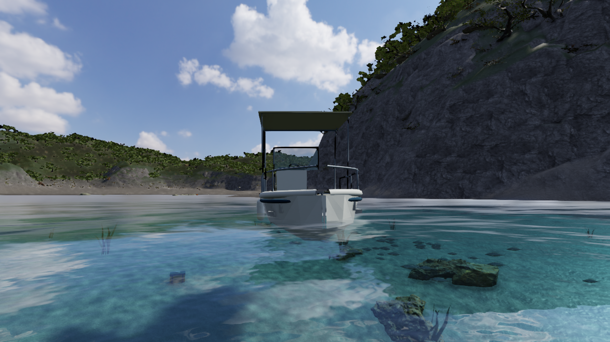
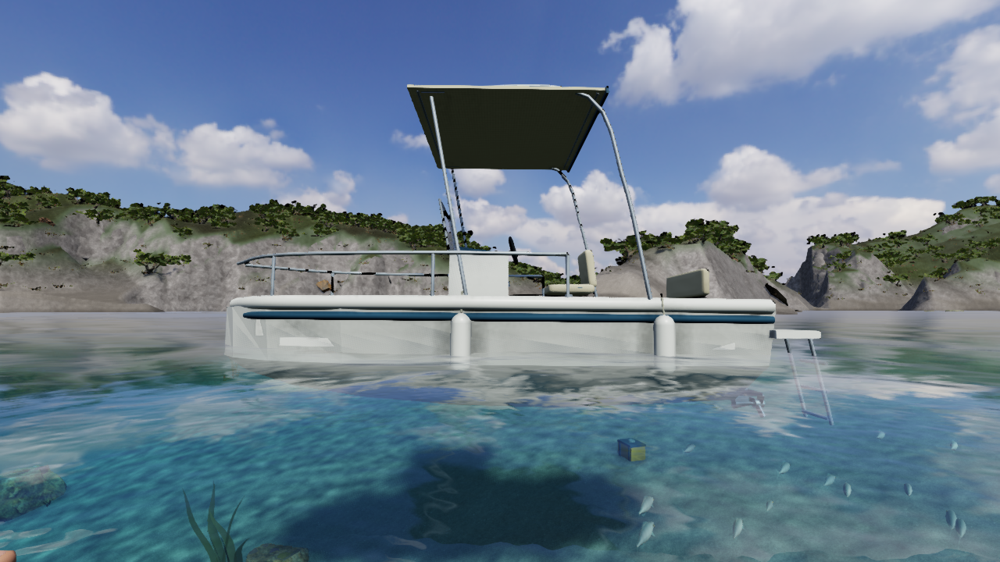
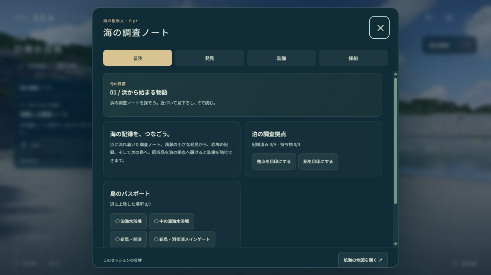

# V35 — 船体の三角面ごとの陰影を修正

実装: `93234090e4cb5eef66d80a54fac59b9c5675e9bb`。比較元: V34 `4c7533cf5835e5375607954b836b5ed58aed5139`。

船へ泳いで近づくと、白い船首と舷側が三角形ごとの板に見えていました。頂点を三角形ごとに分けた形状へ面法線を付けていたことが原因です。船首・左右・底面を面のまとまりごとに平滑化し、船底との折れや前後の端面は別の法線を保つようにしました。

位置、UV、頂点数、境界寸法は以前と同一です。窓・レール・椅子・共有材質、船の移動と乗降判定を変更せず、船体の陰影を直しています。

| 修正前 | 修正後 |
| --- | --- |
|  |  |
|  |  |

## 確認した範囲

- 船体外側・内側それぞれ222頂点、位置とUVのバッファ、境界のハッシュがV34と一致。曲面の同じ位置では有限・単位長の共通法線になり、端面と船底との角は保持しています。材質ごとの描画結合後も、新しい法線と他の部品の法線を保持することを確認しました。
- 不具合を再現する法線の検査が修正前に失敗し、修正後に成功。船体・乗降・船尾のはしご・手動操船などの10項目と、全330テスト、型検査、本番ビルド、単体HTML生成が成功しました。
- 船首・明るい側・暗い側の3組を、同じカメラ・姿勢・1280×720・high・day・停止状態・時刻34.016667で比較。独立した画像レビューは、面ごとの明暗の改善と必要な角の保持を確認し、今回の修正を採用と判断しました。レビューは保存画像とメタデータの確認で、別担当のGPU再実行ではありません。
- 描画形状の位置を変えていないため、V34の連続プレイ記録とは別に、船の物理形状と乗降の回帰検査を確認しています。V35で全島を再航海したことは意味しません。

通常で有効です。`boatnormals=0` は比較用の旧陰影です。頂点や三角形の追加はありません。

## 保存HTMLの実行確認

約269MBの`sea.html`本体を、Viteを介さない静的HTTPから内蔵ブラウザへ読み込みました。海、写真の空、岩、植生、崖の素材がreadyとなり、実際の画面を描画しています。開発用の`__seaQA`は配布版にありません。起動後のResource Timingで外部HTTP素材要求は観測されませんでした。

Jキー操作で調査ノートが開くことを確認しました。Wの短いタップではフレームをまたぐ押下にならなかったため、DOMのkeydown/upを1.2秒の間隔で送り、配布版の通常コントローラーで約2.1m歩行することも確認しました。これは合成DOM入力であり、ネイティブなキー長押しの証拠とは区別しています。通常ユーザーの進行データを変更しないcaptureセッションで実行しました。

直接の`file://`起動は未検証です。起動、HTTPでの実行、配布版への入力の各範囲を分けて記録しています。

記録: [チェック結果](checks/v35/checks.json)、[比較元カメラ](checks/v35/before-cameras.json)、[比較後カメラ](checks/v35/after-cameras.json)、[独立画像レビュー](checks/v35/visual-review.json)、[保存HTMLの読込](checks/v35/standalone-start.json)、[コントローラー入力](checks/v35/standalone-controller.json)。

## 未達の条件

船体の角形・斜めの明るい斑点、広い面の均質さ、上部設備や手すりの簡素さは残っています。岩・砂・植生・海色・魚・体・手、全海岸と全島の実プレイも引き続き改善対象です。全体の写真同等の品質と、完成後に作る最終紹介動画は未達のまま継続します。
