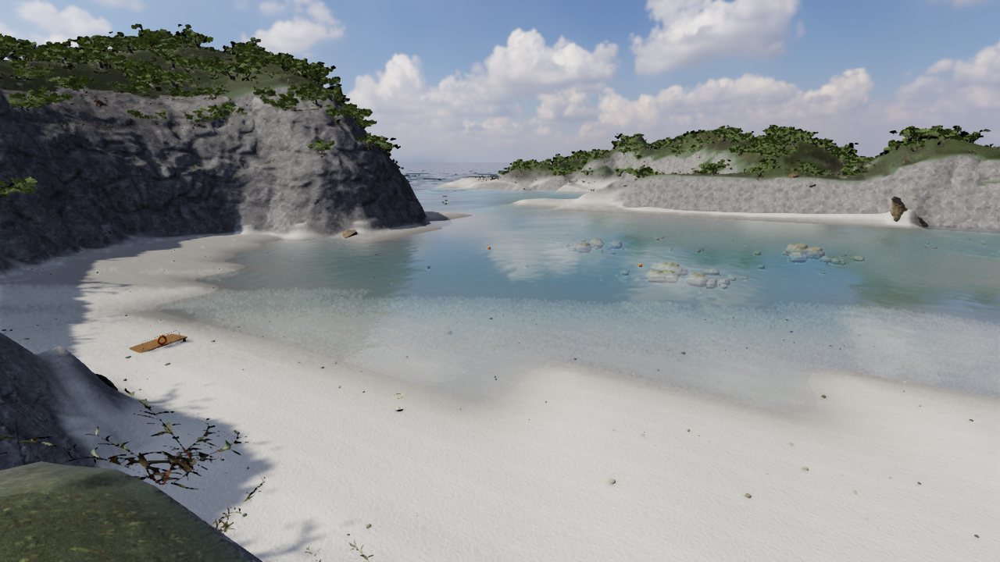

# V37 — 白砂と透明な浅瀬の材質

2026-10-07。[式根島観光協会の泊海水浴場](https://shikinejima.tokyo/play/beach/tomari_beach/)の[入り江の写真](https://shikinejima.tokyo/cms/wp-content/uploads/2021/08/tomari_beach_01_photo01.jpg)と[水際の写真](https://shikinejima.tokyo/cms/wp-content/uploads/2016/02/tomari_beach_01_photo02.jpg)を内蔵ブラウザで再確認した。実景との比較は撮影位置・天候が異なる方向性の比較であり、画素位置の一致や測量精度を主張しない。第三者の写真はゲーム素材・このリポジトリへ転載していない。

## 見つかった原因と変更

従来は暗い砂のCC0写真 `sand_02_diff_2k.jpg` を70%脱色して2.25倍した値を、浜と屈折先の海底へ使っていた。全2,048×2,048画素をsRGBから線形へ変換して計測すると、元画像の平均輝度は0.10075974295、平均RGBは[0.1235921,0.0972518,0.0682762]。単純な倍率では参照の白い砂浜の材質にならず、浅瀬も暗い底の色を引き継いでいた。

写真の粒の位置、実寸2.14mのUV、法線、粗さ、濡れた砂の0.62倍の暗さを維持し、乾砂の反射率を作者指定の線形RGB[0.58,0.56,0.50]へ合わせた。相対輝度の0.45乗で粒状の濃淡を残し、少量の元の色差も保持する。最大反射率は0.88。これは現地の鉱物や砂を実測した反射率ではない。

`sand-reflectance.ts` の同じ関数を陸上の材質と任意の形状屈折の海底材質で使用する。照明・空・露出・吸収係数・Fresnel・地形・衝突・樹木配置は変更していない。通常ON、`?whitesand=0` で以前の材質へ戻せる。

## 実画面の比較

spawn、shore、lookout、reef、cliff、habushi-front、secretの**7視点**で、同じカメラ・時刻34秒・昼・高品質・1280×720を固定し、旧材質→候補→旧材質を撮影した。[比較メタデータ](checks/v37/comparisons.json)、[画素計測](checks/v37/comparison-metrics.json)、[検証スクリプト](checks/v37/verify-evidence.py)を保存した。

| 観察 | 結果 |
| --- | --- |
| カメラ/姿勢/品質/解像度/時刻 | 7組すべて一致 |
| 衝突・solid登録の診断値 | 各組の3枚で一致 |
| RGB全成分254以上の白い飽和画素 | 候補7枚すべて0画素 |
| 旧材質へ戻した画像の平均絶対差（0〜255） | 6視点0、reefは0.114975 |
| 羽伏浦ゲート前 | 候補と旧材質の画像差0。専用の新島地表はこの変換を使わない |

reefの微差は残るため完全な画素再現とは呼ばない。whole-frameのdraw/triangle値は反射（3フレームごと）・影（4フレームごと）の更新を含み、撮影フレームにより異なる。これを新しいジオメトリの増加やFPS比較として扱わない。

独立したSol担当はspawn/lookout/reef/shoreを比較し、**白砂材質の改善として限定採用可**と判定した。明確な白飛びはなく、乾砂の灰色が減り、浅底と岩が分離する。一方、明るい広面積で濃淡が弱まり、濡れ境界が少し読みづらくなる。既存の直線的・段状の水際は残っている。Humanによる最終アート承認や全体の実写同等判定ではない。

## 実行・境界

- 全338テスト、型検査、Vite、単体HTML生成を通過。既存の明示的な旧地表shaderの同一性も保持する。
- 任意の形状屈折を実GPUで有効にし、shoreの3枚比較を確認。receiver/bridgeのavailable=true、エラーログなし。確認後は通常の形状屈折OFFへ戻した。[記録](checks/v37/geometry-check.json)
- 静的HTTPから保存版を開き、砂の標準値1、空と植生ready、実画面、QA APIが含まれないことを確認。[起動記録](checks/v37/standalone.json)、[画面](checks/v37/standalone.jpg)。この起動のResource Timingに外部HTTP素材要求は記録されなかった。file://は未検証。
- 単体HTML: 268,908,565 bytes、SHA256 `13d94dcf41b12fcef1fcf4786899e8fc5df49543f0f33d72ea8b42b1e5392543`。
- 調査と独立画像レビューは別担当。両完了turnのモデルgpt-6.1-sol/lowを確認。権限はwritableで、読み取り限定は依頼上の制約。

先行した樹冠の調査では、tree_01の幹LODに元の属性連結領域をまたぐ面がnear46/mid60/far37枚あったが、葉・枝では0枚だった。[調査値](checks/v37/canopy-investigation.json)。葉の見え方の原因をUV破壊とは決めず、今回の樹木形状は変更していない。

全海岸の形状、植生密度、水際の接続、人体・魚・船、全島の実プレイと最終紹介動画は引き続き未達。写真と見分けがつかない全体品質はまだ達成していない。
