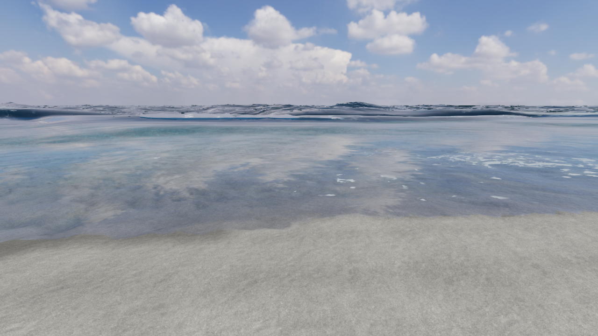
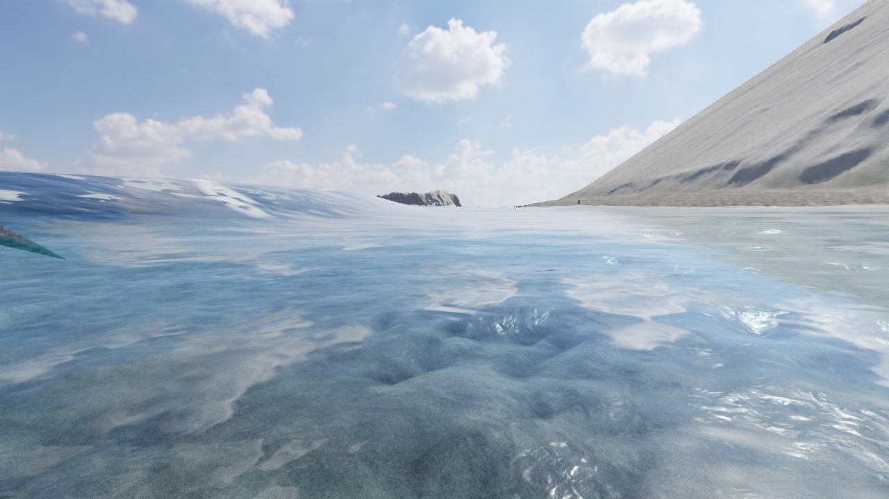
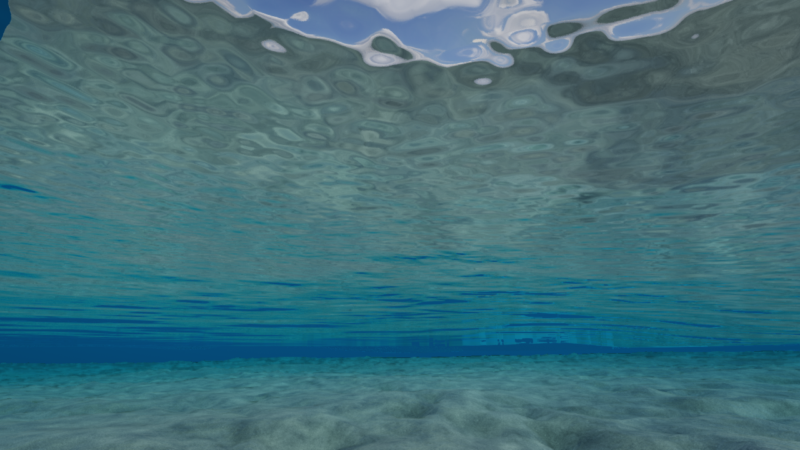

# V52 — 波頭の継続追跡。見た目は未採用

**全体ゴールはACTIVE / UNMET。立体波は通常OFFのまま。** V51の[先行研究](research/sea-prior-art-v51.md)から、毎フレーム別の最大点を選ぶ処理を、同じ波を追うGPU処理へ進めた。現在の円弧状の面は実写品質に達しておらず、この候補を通常表示へ昇格させない。

## 実装したこと

- `shore-front.ts` が97個の追跡点へ局所的な波ID、位置、高さ、向き、速さ、年齢、強度を保持する。波面の傾きから方向を取り、狭い補正範囲で同じ前面を追う。別の高い波へ毎フレーム選び直す方式から変更した。
- 同じFFT/SWEと地形の関数から、96m四方・192²画素の参照場を作る。0.5m間隔の補間であり、現地精度や水面の完全一致を意味しない。追跡点と場の色バッファは合計1,188,960 bytes。通常フレームでGPUからCPUへ読み戻さない。
- 最初の直接サンプリング版では、実景の起動時にGPU接続中断を観測した。重い水面評価を追跡探索から分離した後、実際のサンプラーのGPU検査と海岸描画を確認した。ドライバー内部の原因を特定したという意味ではない。
- 固定した水深2mの輪郭を探す前提を除いた。現在のゲーム地形では `(5888,-986)` の床が約+0.480m、24m東の床が約−1.031mで、従来の探索内に2mの水深がなかった。これは**ゲーム地形の確認**で、現地海底の実測値ではない。現在は濡れていて砕波の兆候がある範囲から発生させる。
- 時刻の巻き戻し、大きすぎる時間刻み、地形の変更、風・うねりの設定変更、遠い計算範囲への移動で履歴を初期化する。IDは局所的・一時的なもので、全世界の永続IDではない。
- 表示側は同じIDの近隣点をつなぎ、端を水面へ戻す。持ち上がった面へ海面の泡を一面に転写しないようにした。表裏の境界をindexで接続し、外向きの面を描画する候補は37,632三角形。indexの閉鎖は、動的な形の自己交差がないことや保存される水の体積を証明しない。

`?breaker=1` で追跡候補を起動し、`?breaker=1&breakertrack=0` で旧ドライバーを比較できる。通常のUIに移動モードや瞬間移動を追加していない。

## 数値・実行の確認

関連する波、水面照会、泡、撮影排他制御の**86テスト**、型検査、Vite、単体HTML生成が成功した。今回は全テストの再実行ではない。詳しくは [証拠集計](checks/v52/evidence.json) と [GPU結果](checks/v52/gpu-final.json)。

実GPUへ既知の移動波を与え、30/60/120Hz、参照場あり/なしで確認した。離れた別の波が急に高くなってもIDは保持され、試験内の解析的な前面位置との差は最大約0.158mだった。これは現地の波の計測精度ではない。斜め0.4radの波では17点が有効で、方向の内積の最小値は約0.999899。停止中のカメラ移動、時計・風の変更、乾いた床、深海、遮蔽、範囲外などを確認した。

新島の実行でも波が発生し、同じIDで岸へ移動した。最初の条件では発生0だったが、2m輪郭の制約を除き、波の方向を取る処理へ変更した後は最大97点が有効になった。発生数やIDの維持だけで、見た目や流体の正しさを認定しない。

保存版は実際に起動し、開発用 `__seaQA` が無いこと、外部素材へのHTTP通信が無いことを確認した。Mキーで地図を開閉した。キー送信先を非フォーカス要素のbodyにした試行は操作ツールが失敗したが、フォーカス中の地図ボタンからのMは成功。診断のbody本文に含まれた非表示のGPU案内を、一時GPU障害と誤って解釈した説明は訂正済み。非表示属性と継続する描画フレームを確認した。[操作記録](checks/v52/standalone-ui.json)。

## 見た目の確認と不採用理由

保存版の実験フラグでも、開発QAなしのまま97点・37,632三角形の候補が起動し、GPU更新2回・readyを確認した。エラーログはなく、外部素材通信も0だった。[保存版の候補診断](checks/v52/standalone-candidate.json)。この起動確認は見た目の承認ではない。

正面、泳ぐ高さの横向き、水面下で、同じ凍結状態の「候補なし→あり→なし」を確認した。16組で最初と最後の画像は全画素一致した。比較中だけ身体を隠し、終了後に戻している。開発用の視点設定による診断であり、実際に歩いて全経路を通した証拠ではない。

独立したSolの画像レビューは2回とも **candidate-only**。初期の尖りを弱めても、正面には白灰色の板と青い直線的な縁が残る。側面には候補を表示した時だけ現れる三角形があった。その後の境界閉鎖と外向き描画は実装・確認したが、選択した後続の画像だけで、この突起が全て解消したとは判断しない。[初回](checks/v52/visual-review-1.md)、[再レビュー](checks/v52/visual-review-2.md)。

水中の水平な縞・矩形の境界は、候補なしの画像にもある。候補の追加だけの不具合へまとめず、基盤の水中光学として追う。

## 次の実装境界

追跡点は次の放出履歴の基盤に使えるが、現在の表示は固定断面を変形する方式である。円弧の係数を調整し続けるだけで通常採用を目指さない。

1. 波から放出される点・面に速度と履歴を持たせ、重力による落下、着水、泡・飛沫へつなぐ。波の位相の速さをそのまま水粒子の速度とせず、場の流速と鉛直方向の条件から放出を定める。履歴の世代と局所IDを一緒に扱い、リセット時のID再利用を混同しない。
2. 水塊による浮力・遊泳、薄い面との接触、光が通る水と空気の区間を分離して共有する。現在の身体・船の高さ照会へ、単に波の先端の最高値を加えない。
3. 立体面の端部、反射・透過、水中の基盤の縞を、横・後ろ・水中と動いている状態で確認する。
4. 全体の実写品質、連続した旅と遊び、音、完了後の紹介動画を引き続き仕上げる。

今回の結果は全経路の受入、1cmの現地一致、質量保存、完全な3D流体、長時間の性能、人による楽しさの確認、最終紹介動画の完成を含まない。
