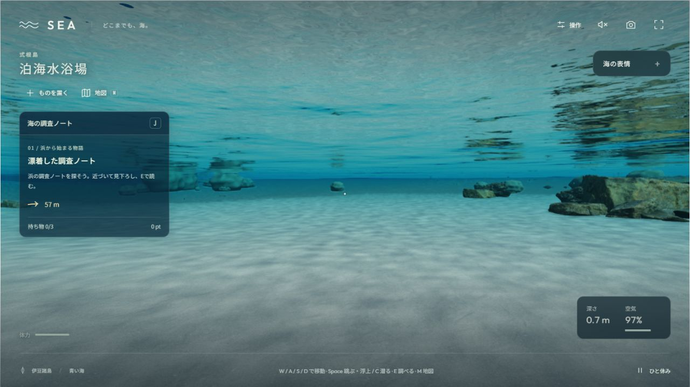
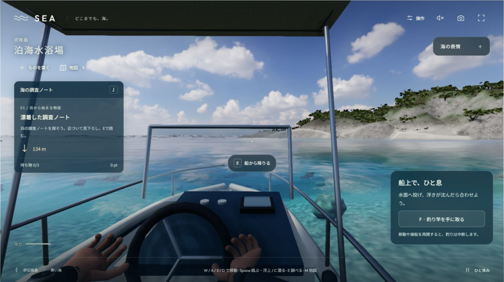
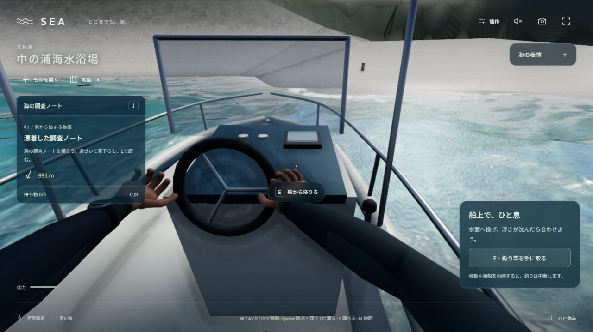

# V56 — 通常の入水・潜水・乗船・中の浦への上陸

全体ゴールはACTIVE/UNMET。実写品質、全岸・全島の旅、完成後の紹介動画は未達。[外部コードの取得と船の修正](research/sea-external-contact-v56.md)。

## 現在の実行証拠

内蔵ブラウザの普通の `http://127.0.0.1:5198/` で確認した。`capture=1`やカメラ設定API、移動モード選択・遠隔移動を使わず、キャンバスのクリック、マウス、W/A/S、C、Space、E、Mと地図の行き先選択を使った。

- 変更前の`cfd7292`通常表示で、浜の歩行と右へのマウス視点、M地図の開閉、自然な入水→泳ぎ→C潜水→Space浮上。潜水直後は深さ約0.69m・空気約96.5%・60fps。[潜水状態](checks/v56/ordinary-natural-dive-immediate.json)、[画面](checks/v56/ordinary-natural-dive.png)。泳ぎはQAのmode切替によるものではない。船外では地図の航海先がdisabledだった。
- 収納竿を修正した通常表示で、泊の開始地点から水際を歩き、足が届かなくなるとswimへ。実船の船尾に横泳ぎで近づくと「E 船に乗る」が表示され、Eで`boarding≈0.053`・climbの連続動作が始まった。[途中](checks/v56/boarding.json)→[操船席](checks/v56/helm.json)。
- 船上でMを開き中の浦を選択。開始時の残り航路は約1,254m。同じ船で移動し、約118秒後の読取りでは中の浦の海岸付近で停船・remaining=0・mode=boat・60fps。[開始](checks/v56/voyage-begin.json)→[到着](checks/v56/voyage-current.json)。これは区間途中を毎フレーム記録した証拠ではなく、通常UIの開始・到着と実表示の観測である。
- 到着後Eで同じ船からはしごを下り、Wで泳ぐ→足が着く→walk・grounded=true・「足が浜に着きました」を確認。[下船](checks/v56/disembark.json)→[上陸](checks/v56/landing.json)。現在の旅は泊→中の浦の片道と上陸まで。帰航・回収・納品・全島・波乗りは今回の受入に含めない。

波が初期停止だったのは`prefers-reduced-motion`への既存配慮であり、波の再生を通常UIで選んだ。接続中断後に残ったWを普通の短いキー入力で解除した最初の接近試行は、乗船成功経路と混ぜていない。停止したプレビューサーバーのPID消失・listener無しを確認してから新しい所有プロセスで再開し、以後の片道は新しい正常タブで確認した。

## 検証と限界

収納竿の軸不整合を旧処理で再現してから修正。新しい剛体取付試験1件、活動状態3件、船体3件の計7テストと型検査・production build・単体HTML生成が成功。独立コードレビューは対象2ファイルと呼出箇所の静的読解で、画像品質の独立承認とは区別する。

現在の実画面には、植生の疎らな反復、崖の形の差、身体と舵の接触不足、中の浦の単純な陸地が残る。V55の3D崖候補は引き続きDEV専用・通常不採用。新しい通常移動の成功を、その候補の床・張り出し下の歩行や見た目の承認へ転用しない。

次の作業は、参照に対応した崖の足元の接続と植生の複数個体、船・身体・道具の実接点を改善し、現在版で帰還と発見・回収・納品・保存復帰へつなぐこと。最終紹介動画は未制作。
