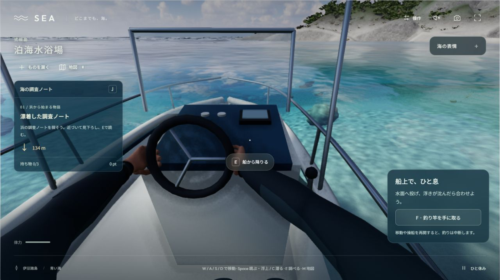
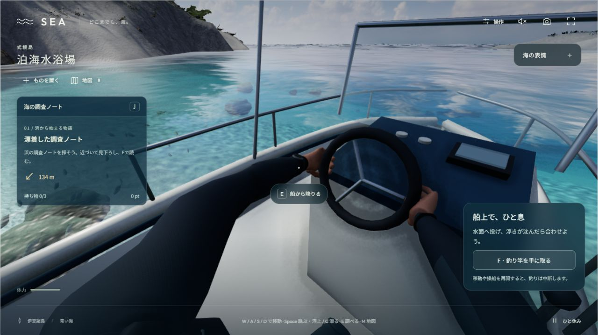

# V57 — 実際の舵へ手を合わせる

2026-10-09。全体goalはACTIVE/UNMET。今回は操船の握りを通常採用する。崖・植生、腕の造形、後ろを向いた身体、全島の遊び、完成後の紹介動画は未完了。

## 原因と変更

旧版の手首は船の固定点を追っていたが、輪の接点から逆算した位置ではなかった。旧`65f15ae`のrigを別のローカル検査用コピーで実行すると、掌の皮膚頂点と理想的な輪表面の最短距離が約46.35mmあり、新しい接触回帰試験に失敗した。

舵の中心、半径、太さ、傾きを描画と共有し、掌の接触点から手首位置と姿勢を求めた。腕の骨の長さを保ち、着座して届かせる際の肩の5cm前進と、指ごとの曲げ方を加えた。船より小さく制限していた身体の傾きも同じ船の姿勢へ揃えた。釣り中は握りを解除し、既存の補間で復帰する。歩行・泳ぎの姿勢と身体の頂点・骨数を保持した。

この人体と表面は作者指定のモデルで、実人体の撮影・計測データではない。輪もゲームの船の形状であり、現地1cm一致の証拠とは扱わない。

## 確認した範囲

- [接触試験](../tests/helm-hand-contact.test.ts):3つの船姿勢、7つの視線yaw、3つのpitchの**63姿勢**。後方±πとその境界、船の最大pitch±.24・roll±.28を含む。左右の掌・4指・親指の12分類を、実際のCPU skin変形後の頂点から測る。各分類の最短距離4mm以内、4mmを超える貫通なし、7mm以内の頂点が2%以上を確認した。面積2%や分類内全頂点の接触を主張しない。
- 同じ最大傾斜の3姿勢で、船座標に戻したブーツが甲板上、骨盤の座席アンカーが不変、骨盤側皮膚が既存クッション上端の7.5mm以内を確認。身体だけの傾斜制限で接触が外れる回帰を防ぐ。
- 関連11テスト（新しい2件、活動状態3件、人体形状/材質2件、GPU skin有限性4件）と、既存の身体の連続姿勢・座席・リソース解放契約。型検査・production build・単体HTML生成成功。人体は36,700三角形・47骨のまま。
- 別の担当が回転順・blend・肩位置の復元・wheel描画の同一性を静的レビュー。指摘された後方yawと傾斜時の座席/足を追加検証した。

距離の基準は描画する輪の**解析的なtorus**。描画メッシュは24×8分割なので、実際の画素深度の誤差や接触面積の厳密測定とは別である。

## 通常のプレイと見た目

内蔵ブラウザの普通の入口からW/A/Eで、浜→歩行→自然な入水→船尾のはしご→操船席へ到達した。カメラ設定API、mode選択、瞬間移動は使っていない。マウスで下・左右・後ろを向き、Wで手動操船した。動いていた観測では船速約6.13m/s・60fps。これはその観測の性能で、全端末の保証ではない。

DEV専用の読み取り観測器`__seaHelm()`は、現在の描画用actorからCPU skin頂点を読み、状態や骨を変更しない。通常の実船で、各分類の最短距離は約0.04〜1.42mm、4mmを超える貫通頂点0を確認した。[正面の実状態](checks/v57/normal-forward.json)・[操船中](checks/v57/normal-moving.json)。観測器は配布HTMLから除かれている。

Fで釣り竿を持つと観測器はhelm接触の判定対象から外し、Eで収納後に[握りへ復帰](checks/v57/after-fishing-forward.json)した。これは釣果や竿と指の完全接触の受入ではない。

[独立した画像レビュー](checks/v57/independent-visual-review.md)は**helm限定adopt**。正面・左右・操船中の大きな隙間は改善した。太い筒状の腕と後方の大きな身体の映り込みは、旧V56にもあった既存課題として残した。同じ波時刻の固定A/Bや実写品質の承認ではない。

V56の中の浦からの帰船は開発中のhot reloadで中断されたため、帰還成功としていない。今回の通常実行は新しい浜開始からの乗船・手動操船・釣り道具の持替えまで。全旅程や全体goalを完了にせず、崖・植生と人間らしい身体・接触を継続する。
