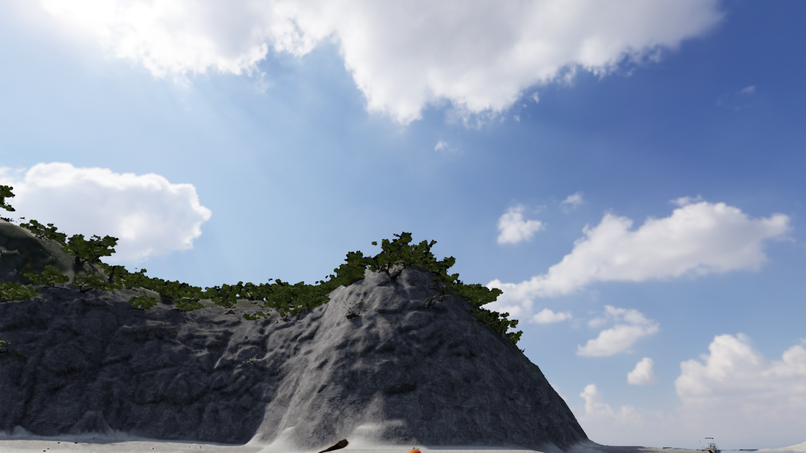
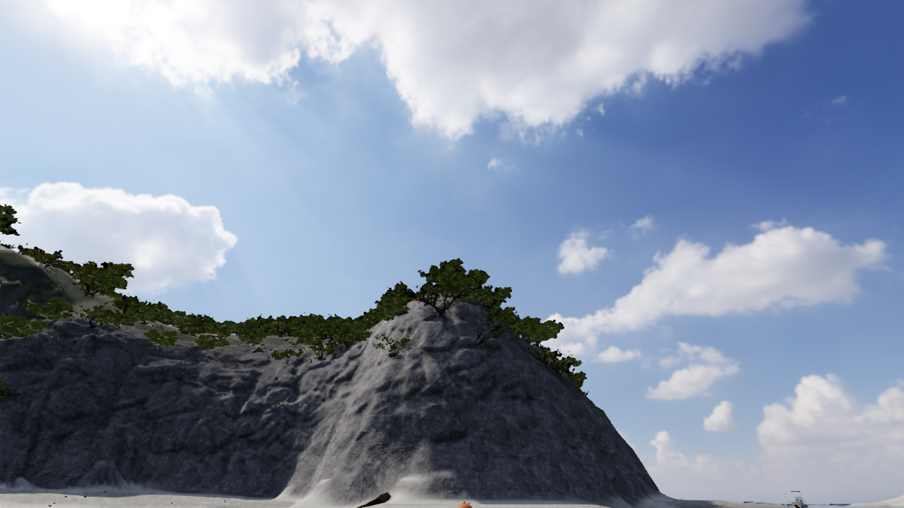

# V60 — 元の葉を残す3種類の樹冠

2026-10-10。全体goalはACTIVE/UNMET。今回の通常採用は、葉・枝の情報を残す植生と、描画距離の予算配分、幹の当たり判定の修正。泊の実測地形と点群由来の植生配置は比較用のまま。実写同等とは判定しない。

## 原因と変更

旧の近接木も全体を約18,000 leaf trianglesへ軽量化していた。例えばisland_tree_01の元の葉は1,060,032 trianglesあり、葉のまとまり自体が消えて枝だけが強く見えた。既存のvariant1用のcomponent-preserving版に加え、公式Poly Havenのisland_tree_02/03を原ファイルのsize/MD5/SHA256で検証し、各葉を個別に簡略化する3D版を生成した。CC0、元の写真テクスチャとUVを保持。近景の木全体は177,354 / 120,486 / 234,938 triangles。遠距離では葉の選択と大きさの補償を使うため、植物学的に正確な葉寸法とは扱わない。高さ・縦横の正規化はauthoring。樹種は未同定。

単に近くの木へ予算を使い切ると、残る約千本が最も粗い表示になる。近接6本分の余地を確保しつつ、可視樹冠の形を先に残す任意の配分を導入。通常の木の上限は6.5M triangles（旧3.6M）で、同じ6.5M同士の比較ではspawnの最粗表示が966から1へ減少。最終観測はnear6 / mid35 / far988 / distant1、6,442,792 triangles、約56.8fps。全方向・全端末の保証ではない。

物理的な幹の基部は、配置と同じnear原形から算出する。描画LODが変わっても物理幹は動かない。遠景の縮約で基部中心が23cm以上ずれた問題を修正した。survey/crownの候補を組み合わせても二重配置しない。素材ロードに失敗した場合、通常の植生へ戻す。

## 確認

- 全112ファイル・499テスト成功。[ログ](checks/v60/full-test.log)。型検査、production build、単体HTML生成成功。
- 新しいnative GLBを読み、元の比率・足元と観測樹冠上端・無効/水中地点拒否を確認。far幹だけを0.9m/0.5mずらしてもphysical proxyがnear根へ一致し、LODを変えてもproxyのidentityを保つ回帰試験を追加。
- 予算配分は実indexed trianglesで上限を検査し、全木の排他的なLOD数と同じ物理根を確認。
- [独立レビュー](checks/v60/independent-review.md)は植生のみ採用可。地形を維持した同一カメラの比較を使った。

固定画像は実WebGLの明示的な停止描画。通常移動やFPSの証拠と混同しない。V59で止まっていた描画は復帰した。

通常画面でWによる浜からの歩行、浅瀬、泳ぎへの自然移行、船へのE乗船、はしごの遷移、着座、W手動操船までを実行。mode変更APIや座標移動は使っていない。[乗船前](checks/v60/before-boarding.json)、[乗船後](checks/v60/on-boat.json)、[操船](checks/v60/boat-moving.json)。観測時約56〜57fps、操船速度約10.49m/s。後半の幹proxy修正と予算再配分後は局所回帰と通常描画を再確認し、同じ全旅程の再実行とはしない。全島の旅程・帰還・納品・セーブ復帰の完了ではない。

## 保留した候補と次の焦点

`tomarisurvey=1` の25cm地形で、浜・近景・海側の3方向を描画できた。実測由来でも岩壁の水平棚、砂の直線、滑らかな壁脚がCGらしく見えるため通常採用しない。原点群の側面とprovider DEMの補間形状を照合する。

`surveycanopy=1` は強い緑色・DEMから0.7〜12mのsource class1の156,079点から686領域を作り、実際のモデルを合わせた538 clumpsの候補。区画を細い木へ変形した初案は却下。元の比率を保つ案へ変更したが、幹位置・樹種・個体数の実測ではなく、写真との分布照合も未完了。通常版は従来の位置を維持する。

船のTerlenka素材は`boatcloth=1`で検証・通常操作中の読込を確認したが、今回の通常採用範囲には加えない。人体の腕、船体の造形、崖と砂の接触、全体のゲーム体験と最後の紹介動画は未完了。

## 保存版の現在の確認範囲

単体HTML生成は成功。2026-10-10の再開時に旧ローカルサーバーが終了していたため、同じ5198/5199のloopbackだけを担当付きで再開した。内蔵ブラウザのエラーページのタブへ再接続する操作がURL形式の安全審査で拒否されたため、別経路で回避せず、保存版HTTP URLを手動で開く操作を依頼した。したがって保存版のGPU起動は現時点で未確認。上の通常操作・画像は開発版での実行記録である。コード/アセット/単体HTMLの保存は行い、mainへの反映は植生改善の実装に限る。全体品質の受入にはしない。
