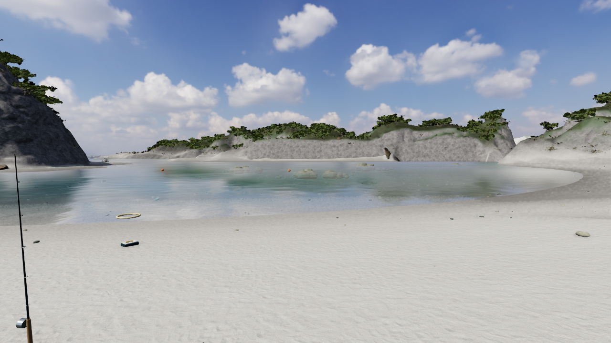
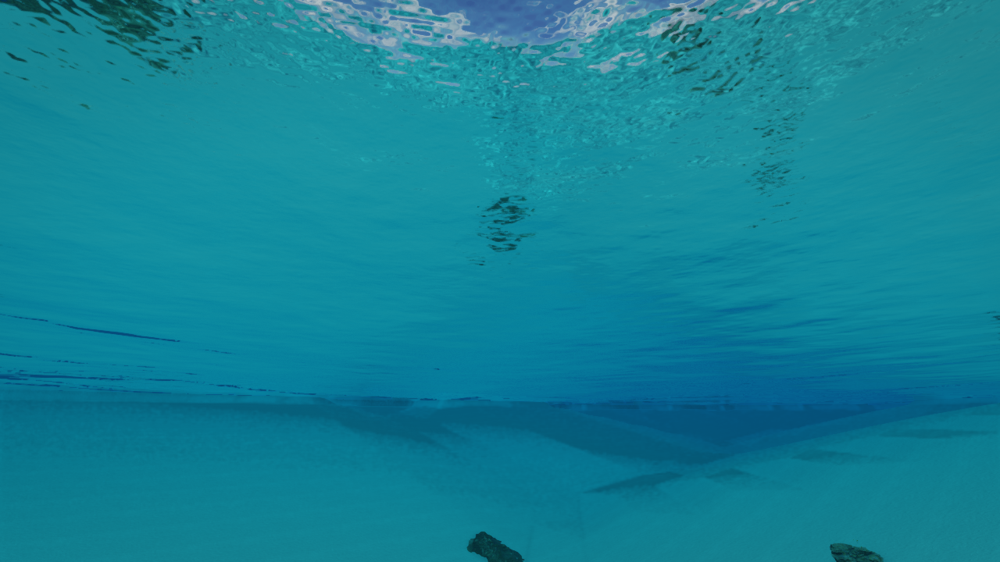

# V61–V63 — 画質を保つ軽量化と実測候補の修正

2026-10-10。全体goalはACTIVE/UNMET。解像度、LOD選択、形状、材質、テクスチャ、影/反射の周期を下げず、魚と植生のCPU処理と反射に出ない描画を減らす。人体・海岸全体の写実品質、全旅程、完成紹介動画は未達。

## V62: 同じ描画データを少ない処理で作る

魚の作業用座標・地形callbackを再利用し、植生の配置を材質ごとに分類し直す重複を除いた。旧コードを独立した比較対象として、魚の状態、全魚/ひれ/尾/眼のFloat32行列、地形照会順と座標、植生の選択・行列順・形状/材質の同一性・境界を完全一致で検査。variant配列の欠番によるクラッシュを統合時に再現し、guardと回帰試験を追加した。

- 魚255匹×1,200フレームのCPU測定: 87.512→82.665ms（深場）、96.496→91.775ms（岸）。[測定条件](checks/v62/fish.json)。
- 植生の合成負荷: 3,000配置2.521→1.764ms、10,000配置9.092→6.877ms。[測定条件](checks/v62/foliage.json)。worker版の測定で、後の欠番guard込みの最終版の再測定ではない。
- 同一カメラ・光・時刻の1280×720の実WebGL画像は全画素一致。[比較](checks/v62/pixel-comparison-12.json)。影4/反射3フレームの周期を満たす12フレームを準備した。

部分的CPU処理の測定であり、ゲーム全体のFPS改善率や実測メモリ削減量へ換算しない。[独立レビュー](checks/v62/independent-review.md)。

## V63: 反射に現れない描画だけ省く

共有された `eba66da` 案はそのまま採用しなかった。固定y=0±5cm判定は実際のReflectorのclipBias・曲率と一致せず、世界行列が更新前で、非表示の物体が影からも消える場合があった。実物Reflectorで問題を再現し、独立レビューを経て修正した。

反射カメラの投影が確定したsceneコールバックで、曲率を含む境界を実際のnear面へ照合する。影の更新回は省略を行わない。未知の頂点変形、スキン、morph、子を持つMeshは従来どおり描く。例外時も元の可視状態とコールバックを復元。比較用に `?mirrorcull=0` を残した。

| 停止観測1280×720 | ON/OFF画像差 | 省略が働く反射更新の削減 | 全12フレーム平均三角形 |
|---|---:|---:|---:|
| 泊の浜 | 0画素 | 1,671,896 | 23,235,180 → 22,817,206 |
| 水中 | 0画素 | 1,921,445 | 33,438,883 → 32,958,521 |
| 沖から島方向 | 0画素 | 0（元から視野外） | 15,643,381 → 15,643,381 |

同じ実行でOFF→OFF→ON→OFFを比較。[画像比較](checks/v63/pixel-comparison.json)。ON画像の最終反射で省略が働くことも確認（33/82/33 meshes）。画像一致はこれらの条件の証拠であり、全端末・全時刻の無差異や写実同等の証明ではない。地形LOD・樹冠impostor・岩LOD、三人称/人体pose/色調の別ブランチは今回導入していない。

## V61: 実測候補の崖脚

`tomarisurvey=1` のみ。実測4.032mの乾いた岩まで旧の低い砂浜へブレンドし、0.484mへ潰していた。ブレンド重みを旧/実測の低い方から実測値へ変更。低い水際のブレンドと12m外周seamは保持した。

元LASと照合した8地点のfixture、実際の世界meshと床、水深map、岩の航行拒否、船着き場と目的地への経路を確認。[LAS照合](checks/v61/fixture-original-las-verification.json)、[56試験](checks/v61/focused.log)。同一2,706点で垂直残差95%値4.327→0.183m、0.5m超616→40点。[対比較](checks/v61/paired-runtime-source-residual.json)。原データとの数値整合であり、現地の絶対精度や1cm一致ではない。

白い砂状の崖脚、地形と不整合な岩、材質分類がなお不自然なため、実測地形候補の通常採用は保留する。

## 検証と未完了範囲

- V62全体実行509件中507成功、2件がJavaScript heap不足でプロセス終了。[初回](checks/v62/full-test-initial.log)。同じコードで失敗2ファイルを1並列で再実行し2/2成功。[再実行](checks/v62/failed-files-recheck.log)。単一実行の全件成功とはしない。
- V63新規反射6試験と旧/新完全一致8試験、計14件成功。[ログ](checks/v63/focused.log)。実際のThree ReflectorでclipBias、曲率、影、移動/境界変更、未知の頂点処理、例外復元を検査。[独立レビュー](checks/v63/independent-review.md)。
- V60保存HTMLのGPU起動は、その後の手動再読込で確認できた。[後続記録](checks/v61/v60-standalone-runtime.json)。当初manifestの未確認は歴史的記録として保持。
- V63のproduction buildと保存版GPU起動は保存manifestと `checks/v63/standalone-runtime.json` に記録する。

人体pose案はidle以外へblendが残り、一人称像や足位置も変わる。取得済みMakeHuman素材はtextureだけで、現行の繰返しUVと互換でない。モデル・UV・骨格・眼点・舵/釣りの手の接点・海中receiverを保つ別工程が必要。遠景、近距離の崖肌/砂、人体、音、全島の遊び、完成紹介動画は未完了。
